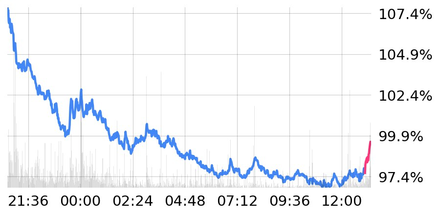
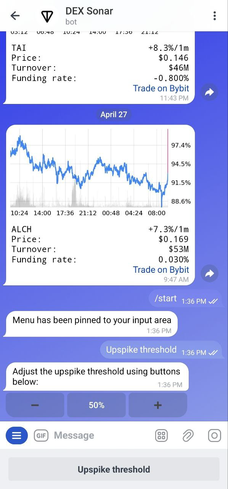

# DEX Sonar

A real-time Bybit market monitoring system that detects price spikes across linear USDT perpetuals and delivers chart alerts to a Telegram operator. Built around a strict minute-candle state model with explicit time alignment, stream drift handling, and inspectable detection logic.

<table>
  <tr>
    <td width="70%" valign="top">
      
    </td>
    <td width="30%" valign="top">
      
    </td>
  </tr>
</table>

## What It Does

On startup, the system:

1. Loads a layered config preset (`default`, `production`, or `test`)
2. Resolves environment variables and database access
3. Discovers active Bybit USDT perpetual contracts and filters by minimum turnover
4. Backfills aligned minute candles for each contract
5. Subscribes to live ticker and kline websocket streams

Once running, it maintains per-contract price state, evaluates spike conditions on every update, and sends a Telegram alert (monospace summary + matplotlib chart + Bybit link) when a spike is detected.

Historical dataset generation shares the same exchange wrapper, parsing logic, and time alignment rules — it is an alternate execution path, not a separate pipeline.

## Architecture

### Components

| Component | File | Responsibility |
|---|---|---|
| `Application` | `src/main.py` | Wires all components; runs three concurrent async tasks |
| `LiveContracts` | `src/contracts/live_contracts.py` | Instrument discovery, backfill, subscription management, resync |
| `Contract` | `src/contracts/contract.py` | Per-market state: prices, turnover, metadata, chart rendering |
| `PybitWrapper` | `src/contracts/pybit_wrapper.py` | Exchange boundary: HTTP + websocket, Pydantic parsing |
| `TimeSeries` | `src/support/time_series.py` | Invariant-enforcing time-indexed storage |
| `SpikeDetector` | `src/core/spike_detector.py` | Threshold-based spike detection over multiple lookbacks |
| `CustomBot` | `src/core/custom_bot.py` | Telegram operator interface |
| `UpspikeThreshold` | `src/support/upspike_threshold.py` | Persisted, operator-adjustable detection multiplier |
| `Dataset` | `src/dataset.py` | Historical `.npz` dataset generation |

### Concurrent Tasks

The `Application` runs three async tasks inside a single Telegram bot loop:

- **Status updater** — posts uptime to the bot description every minute
- **Contract sync** — maintains websocket connections, triggers resyncs on drift
- **Callback processor** — drains a queue of detected spikes, renders and sends alerts

### Data Flow

```
Bybit ticker stream  →  Contract.prices (current minute, mutable)
Bybit kline stream   →  Contract.prices (finalize minute, immutable)
                              ↓
                       SpikeDetector.detect()
                              ↓
                       SpikeMessage (text + chart)
                              ↓
                       CustomBot.send_message()
```

## Key Design Decisions

### Time is a structural invariant

`TimeSeries` enforces:

- a fixed start timestamp
- a constant 1-minute step
- updates that either modify the current slot or extend by exactly one step

Gaps are padded, not skipped. This gives the whole system a stable index-based view of time regardless of stream irregularities.

### Provisional vs. final candles

Two update paths coexist:

- **Ticker updates** mutate the current (in-progress) minute — enables low-latency detection
- **Kline updates** (`is_final=True`) finalize a minute slot — once finalized, it is immutable

### Detection is a configurable surface

The spike threshold is a function of three factors multiplied together:

- **Piecewise linear base threshold** — varies by lookback duration (1m → 30m)
- **Turnover multiplier** — contracts with higher volume require larger moves
- **Operator multiplier** — adjustable at runtime via Telegram (0.1 → 3.0, step 0.1)

The detector evaluates all lookbacks up to `max_range` minutes, selects the strongest qualifying move, and enforces a per-contract cooldown (~60 min by default) to suppress alert spam.

Default configuration: upspikes only, max-change preference, 60-minute cooldown.

### Exchange logic stays at the boundary

`PybitWrapper` is the only module that knows about Bybit. Everything else operates on normalized Pydantic models. Both live monitoring and dataset generation use the same wrapper.

## Project Structure

```
src/
  main.py              # Application entry point
  dataset.py           # Historical dataset generation
  config/
    config.py          # Layered INI config loader
    parameters.py      # Env var resolution + typed parameters
  contracts/
    pybit_wrapper.py   # Exchange boundary (HTTP + websocket)
    live_contracts.py  # Live orchestration
    contract.py        # Per-contract state
    contracts.py       # Contract registry
  core/
    bot.py             # Base Telegram bot
    custom_bot.py      # Operator interface
    message.py         # Alert rendering (text + chart)
    spike_detector.py  # Detection logic
    workflow_runner.py # Async task runner
  support/
    logs.py            # Logging setup
    time_series.py     # Time-indexed storage
    upspike_threshold.py  # Persisted multiplier (SQLAlchemy)
  utils/
    time.py            # Time, Timedelta, Timestamp, Cooldowns
    paths.py           # Path resolution
    utils.py           # Misc helpers
configs/
  default/             # Base config (used locally)
  production/          # Production overlay (Heroku)
  test/                # Small universe + relaxed thresholds
tests/
  test_time_series.py  # TimeSeries invariant tests
deploy/
  *.sh                 # Heroku deployment scripts
```

## Installation

Requires Python 3.11.

```bash
uv venv --python 3.11
source .venv/bin/activate
uv pip install -r requirements.txt
```

### Environment Variables

| Variable | Description |
|---|---|
| `USER_ID` | Telegram user ID of the whitelisted operator |
| `BOT_TOKEN` | Main bot token |
| `SILENT_BOT_TOKEN` | Silent bot token (no notification sound) |
| `TEST_BOT_TOKEN` | Test environment bot token |
| `TEST_SILENT_BOT_TOKEN` | Test environment silent bot token |

### Database

| Preset | Source |
|---|---|
| `production` | `DATABASE_URL` environment variable |
| `default` / `test` | Fetched via Heroku CLI |

## Running

```bash
python src/main.py              # default preset (local dev)
python src/main.py production   # production preset
python src/main.py test         # test preset (small universe, relaxed detection)
```

Config presets are layered: `default` is always loaded first, then the named preset overlays it.

### Config Reference (default)

| Setting | Default | Description |
|---|---|---|
| `min turnover` | 10M USD | Minimum 24h turnover to include a contract |
| `price update interval` | 1s | Ticker polling frequency |
| `instruments info update interval` | 60s | Metadata refresh frequency |
| `max range` | 30 min | Lookback window for spike detection |
| `max funding rate` | 1%/day | Contracts above this are skipped during detection |
| `cooldown` | 60 min | Per-contract silence period after an alert |

## Development

```bash
uv run python -m unittest discover -s tests
```

The `TimeSeries` tests cover the strongest invariants in the system. There is no enforced linting or CI. `requirements.txt` includes both runtime dependencies and analysis tooling.

## Operational Notes

- The process exits via `os._exit()` to avoid delays from pybit's background threads
- Deployment is Heroku-oriented; see `deploy/` for shell scripts
- The bot is single-operator by design — one whitelisted Telegram user ID

## Extension Points

| Direction | How |
|---|---|
| New environments | Add a preset to `configs/` |
| Additional Telegram commands | Extend `CustomBot` |
| New alert types | Reuse `Contract` + `TimeSeries`, swap detector and message renderer |
| Dataset expansion | Extend `dataset.py` — it is a first-class execution path |
